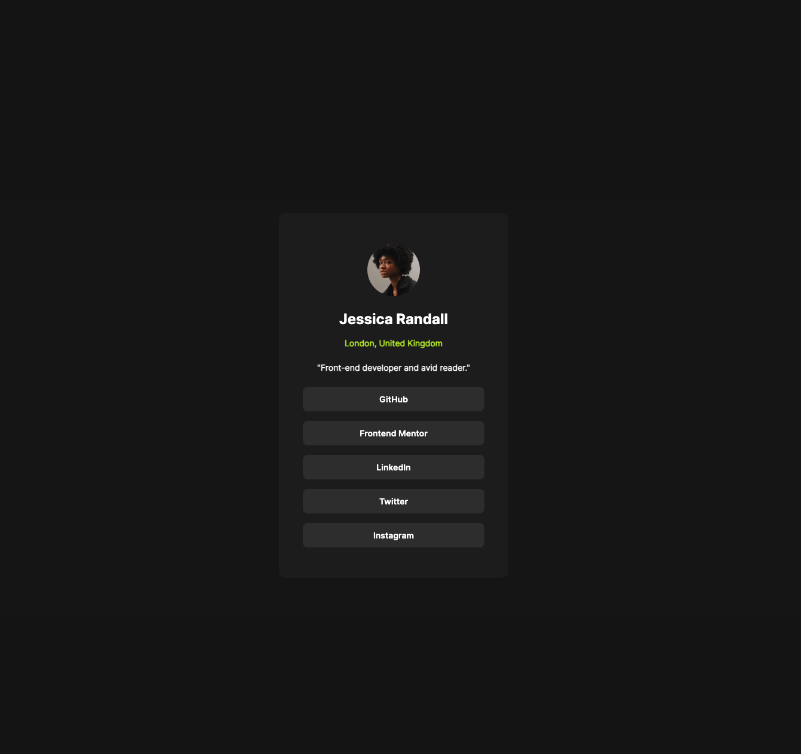

# Frontend Mentor - Social links profile solution

This is a solution to the [Social links profile challenge on Frontend Mentor](https://www.frontendmentor.io/challenges/social-links-profile-UG32l9m6dQ). Frontend Mentor challenges help you improve your coding skills by building realistic projects.

## Table of contents

- [Frontend Mentor - Social links profile solution](#frontend-mentor---social-links-profile-solution)
  - [Table of contents](#table-of-contents)
  - [Overview](#overview)
    - [The challenge](#the-challenge)
    - [Screenshot](#screenshot)
    - [Links](#links)
  - [My process](#my-process)
    - [Built with](#built-with)
    - [What I learned](#what-i-learned)
    - [Continued development](#continued-development)
    - [Useful resources](#useful-resources)

**Note: Delete this note and update the table of contents based on what sections you keep.**

## Overview

### The challenge

Users should be able to:

- See hover and focus states for all interactive elements on the page

### Screenshot



### Links

- Solution URL: [Add solution URL here](https://github.com/AlejandroCavita/social-links-profile)
- Live Site URL: [Add live site URL here](https://social-links-profile-cyan-nine.vercel.app/)

## My process

### Built with

- Semantic HTML5 markup
- CSS custom properties
- Flexbox
- CSS Grid
- Mobile-first workflow

### What I learned

In this project, I enhanced my skills in building responsive web designs using semantic HTML5 and CSS. I learned how to effectively use CSS custom properties for consistent styling and how to implement Flexbox and CSS Grid for creating flexible and adaptive layouts. Additionally, I improved my understanding of mobile-first design principles, ensuring that the project is accessible and looks great on all devices. This project also allowed me to explore the use of Styled Components for managing styles in a modern and scalable way.

To see how you can add code snippets, see below:

```html
<nav>
  <a href="" type="button">GitHub</a>
  <a href="" type="button">Frontend Mentor</a>
  <a href="" type="button">LinkedIn</a>
  <a href="" type="button">Twitter</a>
  <a href="" type="button">Instagram</a>
</nav>
```

```css
.container {
  min-height: 100vh;
  display: grid;
  place-items: center;
  width: 100%;
}
```
```css
.card {
  min-height: 57.9rem;
  box-sizing: border-box;
  min-width: 32.7rem;
  display: flex;
  flex-direction: column;
  align-items: center;
  justify-content: center;
  padding: 2.4rem;
  background-color: var(--grey-800);
  border-radius: 1.2rem;
}
```

```css
a:hover {
  background-color: var(--green);
  color: var(--grey-700);
  cursor: pointer;
}


a:last-child {
  margin-bottom: 0px;
}
```

### Continued development

In future projects, I plan to focus on the following areas:

- **Advanced CSS Techniques**: I want to explore more advanced CSS features such as animations and transitions to create more dynamic and engaging user interfaces.
- **JavaScript Interactivity**: Enhancing my skills in JavaScript to add more interactive elements to my projects.
- **Accessibility**: Improving accessibility features to ensure that my projects are usable by everyone, including those with disabilities.
- **Performance Optimization**: Learning techniques to optimize web performance, ensuring fast load times and a smooth user experience.
- **Responsive Design**: Continuing to refine my approach to responsive design, ensuring that my projects look great on all devices and screen sizes.

### Useful resources

- [Manz.dev](https://lenguajecss.com/animaciones/transiciones/transition/) - This resource was instrumental in helping me understand CSS animations and transitions. It provided clear explanations and examples that I found very useful for implementing smooth and dynamic transitions in my project.

